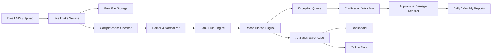
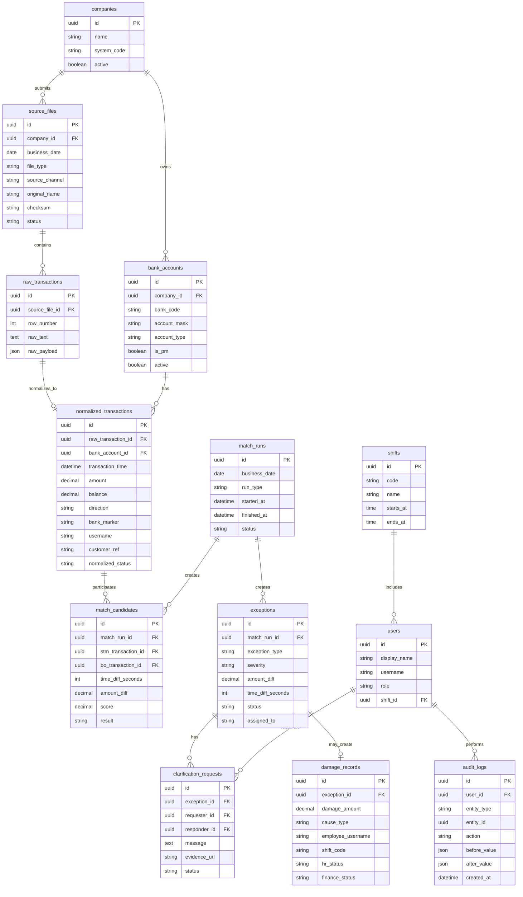

# Audit AI Reconciliation - Architecture

## System Overview

## Core Modules

### File Intake Service

รับไฟล์จาก Email กลางหรือ upload manual แล้วจัดหมวดหมู่ตามวันที่ บริษัท ประเภทไฟล์ และบัญชี

### Completeness Checker

ตรวจว่าข้อมูลประจำวันครบหรือไม่ เช่น STM ฝาก-ถอน, BO, ไฟล์แก้ไขมือ, ไฟล์ชี้แจง และ PM STM

### Parser & Normalizer

แปลงข้อมูลหลายรูปแบบเป็น transaction schema เดียวกัน โดยเก็บ raw text และ normalized fields ควบคู่กัน

### Bank Rule Engine

ทำความสะอาดข้อมูลตามกฎธนาคาร เช่น กรองยอดยกมา, กรองรอบวันที่, ตีความ X1/X2/XB, แยกช่วงข้ามวัน

### Reconciliation Engine

จับคู่ STM กับ BO ด้วย account + time + amount และสร้าง match result / exception result

### Exception Workflow

จัดการ lifecycle ของรายการผิดปกติ ตั้งแต่พบรายการ ส่งชี้แจง รับหลักฐาน ตรวจทาน อนุมัติ และปิดเคส

### Damage Register

เก็บผลกระทบทางการเงิน, ผู้เกี่ยวข้อง, กะ, สาเหตุ, หลักฐาน และสถานะการส่งต่อการเงิน/บุคคล

### Analytics & Talk to Data

สรุป dashboard, trend, KPI และตอบคำถามภาษาไทยจากข้อมูลที่ผ่านการตรวจสอบแล้ว

## Database Schema Draft

## Matching Logic Draft

1. เลือก business date และ company
2. ตรวจ source file completeness
3. Normalize STM และ BO
4. Apply bank rules
5. สร้าง candidate ด้วย account และ amount
6. คำนวณ time difference
7. จัดอันดับ candidate จาก amount match, time window, username/customer ref
8. สร้าง matched result หาก score ผ่าน threshold
9. สร้าง exception หาก missing, amount diff, time diff, duplicated, cross-day, หรือ manual correction
10. ส่ง exception เข้า workflow

## Security Model

- ไม่ login mobile banking โดย bot
- ingest จาก email/export/upload เท่านั้น
- จำกัด role ตามหน้าที่
- ทุกการเปลี่ยน note, status, evidence, approval ต้องบันทึก audit log
- raw file ต้องเก็บ checksum เพื่อพิสูจน์ว่าไม่ได้ถูกแก้ไข
- report สำหรับ Finance/HR ต้องดึงจาก damage record ที่ปิดรอบแล้วเท่านั้น
