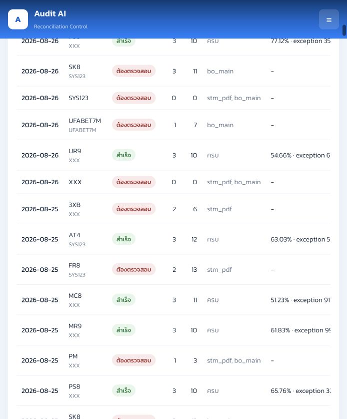
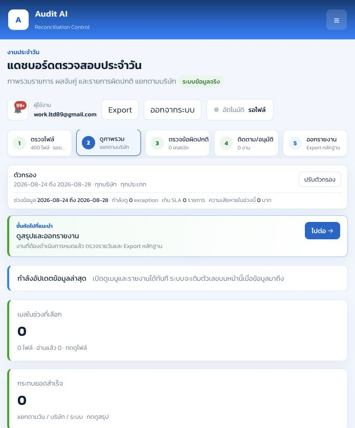
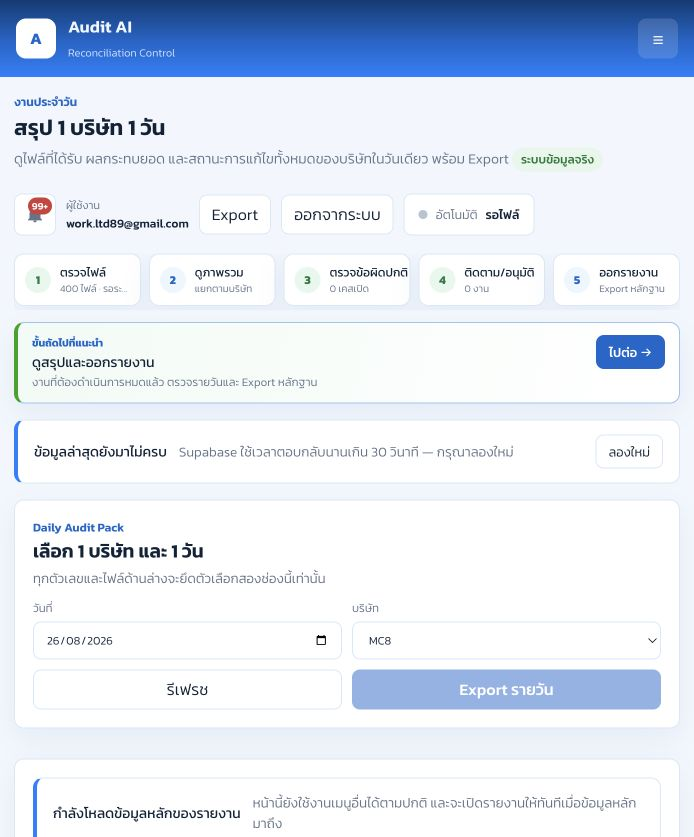
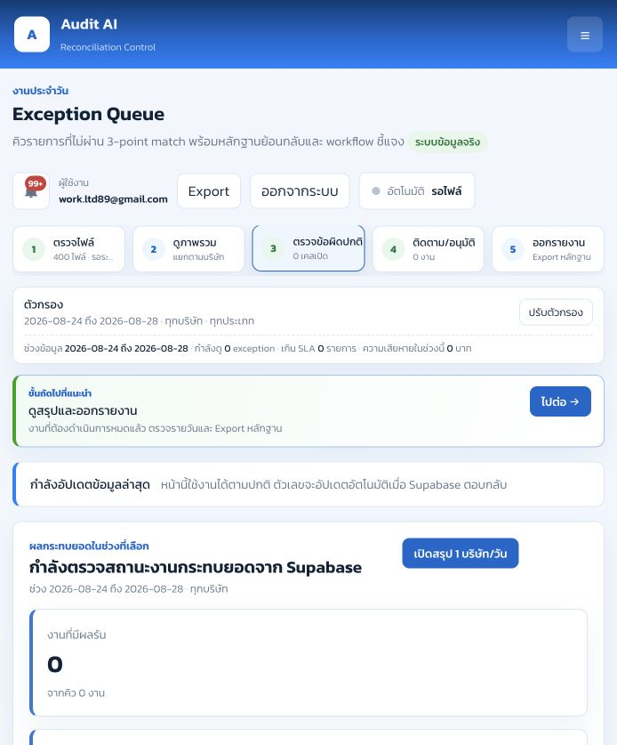
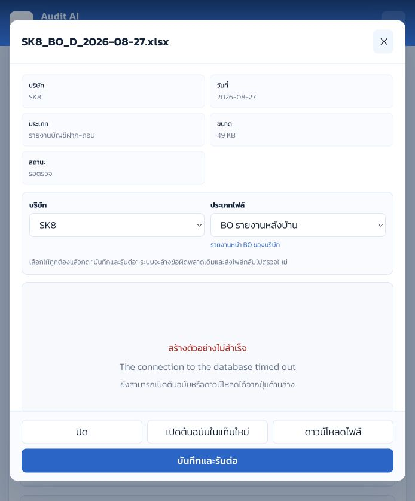
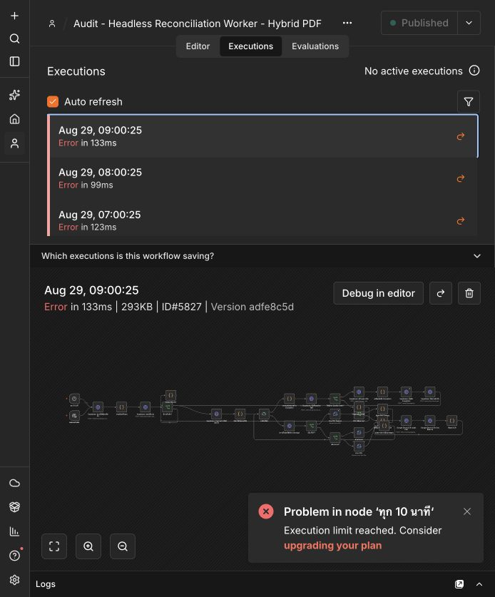
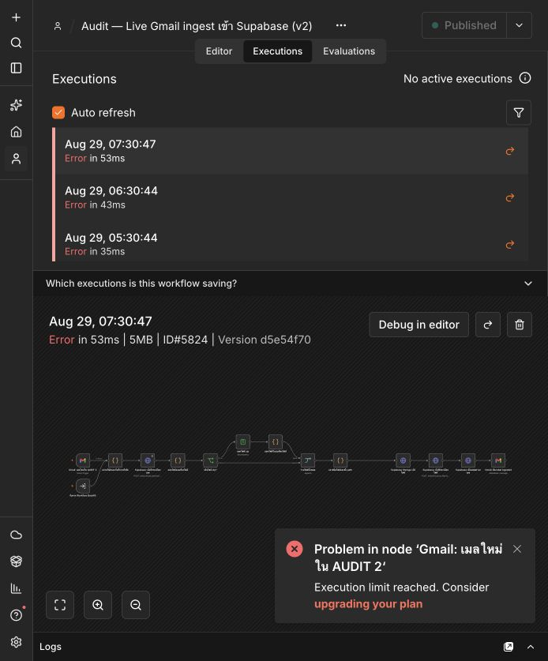

# รายงานผลทดสอบระบบ Audit AI Reconciliation

วันที่ทดสอบ: 29 สิงหาคม 2026 (Asia/Bangkok)  
ระบบที่ทดสอบ: GitHub Pages, Supabase production และ n8n Cloud production  
ผู้ทดสอบ: Codex ร่วมกับบัญชี Audit ที่ล็อกอินอยู่

## บทสรุป

สถานะรวม: **ยังไม่พร้อมใช้เป็นแหล่งรายงานยอดอย่างเป็นทางการ**

ระบบรับไฟล์และทะเบียนไฟล์ยังมีข้อมูลจริงอยู่ แต่หน้าสรุปหลายหน้าไม่สามารถโหลดข้อมูลรวมจาก Supabase ได้ และแสดง `0` ซึ่งขัดกับผลกระทบยอดจริงที่เห็นในหน้าคลังไฟล์ นอกจากนี้ n8n ใช้โควต้า executions ครบแล้ว ทำให้ทั้ง Gmail ingest และ Worker กระทบยอดอัตโนมัติล้มเหลวตั้งแต่ช่วงกลางคืนวันที่ 28–29 สิงหาคม

ข้อมูลจริงที่ยืนยันได้จากหน้าคลังไฟล์ในช่วง 24–28 สิงหาคม 2026:

- 52 อีเมล
- 400 ไฟล์
- อ่านสำเร็จ/พร้อมใช้งาน 310 ไฟล์
- รอประมวลผล 90 ไฟล์
- ไฟล์ที่ขึ้น parse error 0 ไฟล์
- มีผลกระทบยอดสำเร็จอย่างน้อย 16 งานบริษัท/วัน
- Exception ที่ผลรันสรุปไว้ในวันที่ 24–26 สิงหาคมรวมอย่างน้อย 13,674 รายการ

ตัวเลข Exception 13,674 มาจากผลรันที่แสดงใน Cloud Inbox:

- 24 ส.ค.: 3,202 รายการ
- 25 ส.ค.: 3,323 รายการ
- 26 ส.ค.: 7,149 รายการ

แต่ Dashboard, Exception Queue, Reports และเมนูติดตามแสดง 0 เพราะการโหลดข้อมูลส่วนกลาง timeout จึงห้ามตีความเลข 0 ว่าไม่มีรายการผิดปกติ

## ผลทดสอบรายฟังก์ชัน

| ฟังก์ชัน | ผล | รายละเอียด |
|---|---|---|
| เข้าสู่ระบบและสิทธิ์ RLS | ผ่านบางส่วน | เข้าด้วยบัญชีจริงและอ่าน Cloud Inbox ได้ แต่เมื่อ hard reload บนแท็บทดสอบหนึ่งครั้งกลับมาหน้าล็อกอิน ต้องตรวจการคง session/refresh token เพิ่ม |
| เมนูและการนำทาง | ผ่าน | ลิงก์ขั้นตอน 1–5 และ route หลักเปิดได้ |
| Cloud Inbox / ทะเบียนเมล | ผ่านบางส่วน | แสดง 52 เมลและ 400 ไฟล์จริง พร้อมรายการต้นทาง แต่ขึ้น `canceling statement due to statement timeout` ในข้อมูลสรุปบางชุด |
| แยกสถานะไฟล์ | ผ่าน | แสดงพร้อมใช้ 310, รอ 90, ปัญหา 0 และแยกสถานะรายไฟล์ได้ |
| ตัวกรองวันที่/บริษัท/ประเภท | ไม่ผ่านครบถ้วน | เลือก MC8 ได้ แต่ KPI ยังแสดงยอดรวม 400 ไฟล์ เนื่องจาก cache เดิมไม่ถูกผูกกับ key ของตัวกรองและคำขอสรุปใหม่ timeout |
| Preview ไฟล์ | ผ่านบางส่วน | Modal เปิดได้ มีบริษัท/ประเภทไฟล์/คำอธิบาย/ปุ่มเปิดต้นฉบับและดาวน์โหลด แต่ตัวอย่าง Excel ที่ทดสอบขึ้น `The connection to the database timed out` |
| เปลี่ยนประเภทและรันต่อ | ไม่ทดสอบการบันทึก | ปุ่มและตัวเลือกมีครบ แต่ไม่กดบันทึกเพื่อหลีกเลี่ยงการเปลี่ยน production data ระหว่าง QA |
| Dashboard | ไม่ผ่าน | ค้าง `กำลังอัปเดตข้อมูลล่าสุด` และแสดง 0 ทุก KPI ทั้งที่ Cloud Inbox มีผลจริง |
| สรุป 1 บริษัท 1 วัน | ไม่ผ่านในเวอร์ชันที่เปิดทดสอบ | MC8 วันที่ 26 ส.ค. รอเกิน 30 วินาทีและขึ้น Supabase timeout; patch แยกโหลดเฉพาะบริษัทถูก commit แล้ว แต่ต้องยืนยันหลัง deployment/cache refresh |
| Exception Queue | ไม่ผ่าน | แสดง 0 รายการ ทั้งที่ผลรันใน Cloud Inbox มี Exception หลายพันรายการ |
| ติดตาม/อนุมัติ | ไม่ผ่าน | แสดง 0 งานเพราะข้อมูล Exception ส่วนกลางไม่เข้า |
| Damage Register | สรุปไม่ได้ | หน้าเปิดได้แต่ค่า 0 ยังเชื่อถือไม่ได้ในขณะที่ loader ส่วนกลางยัง timeout |
| PM Monitor | ไม่ผ่าน | ค้างที่ `กำลังอ่านไฟล์ PM จริง` |
| Reports รายวัน/รายเดือน | ไม่ผ่าน | ค้างที่ `กำลังอัปเดตข้อมูลล่าสุด` และไม่แสดงตารางจริง |
| Export | ไม่ผ่าน/ถูกบล็อก | การเปิด Export รอ live overview; ไม่เกิด download ภายใน 10 วินาที |
| Bank Rules | ผ่านด้านการแสดงผล | แสดงกฎและ SLA ได้ แต่ KTB ยังขึ้นปิด/รอ sample ขณะที่ parser ใน code มี unit test KTB ผ่านแล้ว ต้องตัดสินใจเปิดใช้ให้ตรงกับระบบจริง |
| Notifications | ไม่ผ่าน | Bell แสดง 99+ แต่หน้าการแจ้งเตือนจริงแสดง 0 เป็นความขัดแย้งของข้อมูล |
| Audit Log | ไม่ผ่าน | หน้าเปิดได้แต่แสดง 0 เพราะชุดข้อมูลส่วนกลางไม่เข้า |
| n8n Gmail ingest | ไม่ผ่าน | รอบ 29 ส.ค. 05:20, 05:30, 06:30 และ 07:30 ล้มเหลวด้วย `Execution limit reached` |
| n8n Reconciliation Worker | ไม่ผ่าน | รอบรายชั่วโมง 23:00–09:00 ล้มเหลวต่อเนื่องอย่างน้อย 11 รอบด้วย `Execution limit reached` |
| Telegram แจ้งเตือน | ถูกบล็อก | ไม่สามารถคาดหวังข้อความรอบใหม่ได้เมื่อ workflow n8n ถูกปฏิเสธตั้งแต่ trigger |
| Unit/registry/parser tests | ผ่าน | `npm test` ผ่าน: engine 47, formats 13, registry 24, PDF STM 48 และ workflow checks ผ่าน |

## ปัญหาที่ต้องแก้ตามลำดับ

### P0 — n8n execution quota เต็ม

ผลกระทบ:

- เมลใหม่ไม่เข้า Supabase
- Worker ไม่กระทบยอดรายชั่วโมง
- Telegram ไม่อัปเดต
- ข้อมูลหลังรอบสำเร็จ 22:57 วันที่ 28 สิงหาคมอาจตกค้าง

ต้องแก้โดยตรวจ Subscription/usage ของ workspace ให้ plan ที่จ่ายถูกผูกกับ instance `work8989.app.n8n.cloud` และ execution allowance ถูกเพิ่มหรือรอบบิลถูก reset จริง จากนั้น retry Gmail ingest และ Worker ที่ล้มเหลว

### P0 — หน้าเว็บแสดง 0 ทั้งที่มีผลจริง

ต้นเหตุ: `loadLiveOverview()` ใช้ `Promise.all()` กับ daily status, operations, quality, checklist และ settings หาก query เดียว timeout จะไม่เขียนข้อมูลชุดใดลง state แล้วหน้าต่าง ๆ ใช้ค่าเริ่มต้นเป็น 0

ต้องแก้:

1. เปลี่ยน core loader เป็น `Promise.allSettled()`
2. แสดงผลส่วนที่สำเร็จทันที
3. แยก `ไม่พบข้อมูลจริง` ออกจาก `โหลดไม่สำเร็จ`
4. ห้ามแสดงข้อความ “งานเรียบร้อย” หรือเลข 0 เมื่อ loader ยัง error
5. ลด query ให้เป็น 1 วัน/1 บริษัทในหน้ารายละเอียด

### P1 — ตัวกรอง Cloud Inbox แสดง cache เก่า

`cloudState` ไม่มี key ของช่วงวันที่/บริษัท และ `cloudLoad()` ใช้ `Promise.all()` เมื่อเปลี่ยน MC8 แล้ว query หนึ่งล้ม ระบบยังแสดงยอดรวมเดิม 400 ไฟล์ ทำให้ผู้ใช้เข้าใจผิดว่าเป็นยอด MC8

ต้องเพิ่ม cache key, reset/mark stale เมื่อ filter เปลี่ยน และแยกโหลด batches/daily/operations ด้วย `allSettled()`

### P1 — Preview ต้นฉบับ timeout

Modal และ metadata ทำงาน แต่ storage signed URL/download สำหรับไฟล์ตัวอย่างที่ทดสอบตอบกลับว่า database timeout ต้องตรวจ Supabase Storage RLS policy และ index ที่ใช้ผูก `storage.objects` กับทะเบียน source file พร้อมเพิ่ม fallback ดาวน์โหลดโดยตรง

### P1 — Session หลัง reload

ควรทดสอบ access token expiry และ refresh token บน hard reload โดยเฉพาะกรณี GitHub Pages เปลี่ยน query string/cache-busting เพื่อยืนยันว่าไม่หลุดจากระบบระหว่างงาน

### P2 — ความสอดคล้องข้อความและกฎ

- เปลี่ยนชื่อ `stm_pdf`/`bo_main` ใน Cloud Operations ให้เป็นคำไทย เช่น `ขาด STM ฝาก-ถอน` และ `ขาด BO รายงานหลังบ้าน`
- ตัดสินใจเปิด KTB Rule ให้ตรงกับ parser ที่รองรับแล้ว
- Bell 99+ ต้องสัมพันธ์กับจำนวน notification จริงหรือระบุว่าเป็นงานค้างรวม ไม่ใช่ unread notifications

## หลักฐานภาพ

### Cloud Inbox มีข้อมูลจริง

### Dashboard แสดงศูนย์ระหว่าง loader ค้าง

### สรุปรายวัน MC8 timeout

### Exception Queue แสดง 0 ทั้งที่ผลรันมี Exception

### Preview ไฟล์

### n8n Worker ใช้ execution quota เต็ม

### n8n Gmail ingest ใช้ execution quota เต็ม

## เกณฑ์ผ่านก่อนใช้รายงานจริง

1. n8n Gmail ingest และ Worker สำเร็จติดต่อกันอย่างน้อย 3 รอบ
2. Cloud Inbox, Dashboard, Daily Summary และ Reports ต้องแสดงจำนวนไฟล์/ผลรันตรงกัน
3. MC8 วันที่ 26 ส.ค. ต้องแสดงผล 54.63% และ Exception 1,105 ใน Daily Summary/Reports โดยไม่ timeout
4. Exception Queue ต้องไม่แสดง 0 เมื่อ `v_recon_quality.exception_count` มากกว่า 0
5. เปลี่ยนบริษัทเป็น MC8 แล้วทุก KPI/รายการต้องเป็น MC8 เท่านั้น
6. เปิด preview ตัวอย่าง PDF, XLSX, CSV และ DOCX ได้อย่างละ 1 ไฟล์
7. Export รายวันต้องได้ไฟล์และยอดตรงหน้าจอ
8. Hard reload แล้วยังอยู่ในระบบหรือ refresh session สำเร็จ
9. Telegram ได้ข้อความหลัง ingest, หลัง worker และสรุปรายวันตามรอบที่กำหนด

